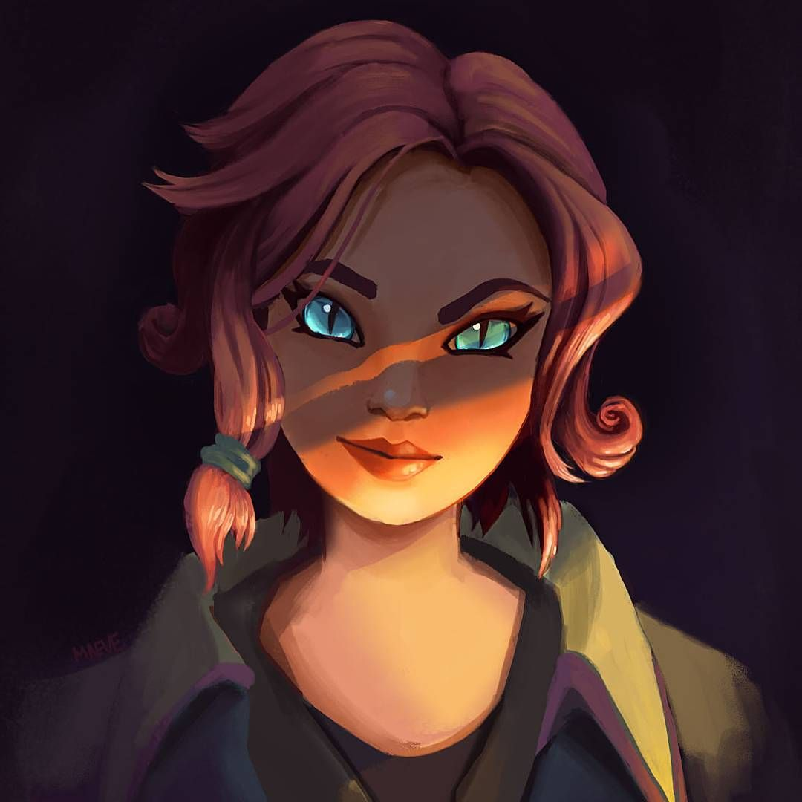

<p  align="center">
  
  <h1 align="center">
    ⚔️ PUGSBOT ⚔️ 
  </h1>
<p>

<p align="center">
    
    
</p>

## What is PUGSBOT ❓

*PUGSBOT* is a bot for pugs on Paladins game. This one can make random teams for parties with your friends.

<sub>Paladins website : https://www.paladins.com/</sub>

## What technology was used ? ⚙️

*PUGSBOT* was created with *Python* language and with *Discord.ext* labrary.

```
pip install discord
```

<sub>Python website : https://www.python.org/</sub>

<sub>Discord.ext website : https://discordpy.readthedocs.io/en/stable/index.html</sub>

## Commands 📋

`- +rdmpugs [@member in vocal channel] ▶️ Create and show teams for pugs (randoms teams).`  

`- +leaders [@member in vocal channel] ▶️ Give 2 leaders among the members on vocal.`

`- +map ▶️ Give random map.`

`- +helps ▶️ All description of BOT's commands.`


